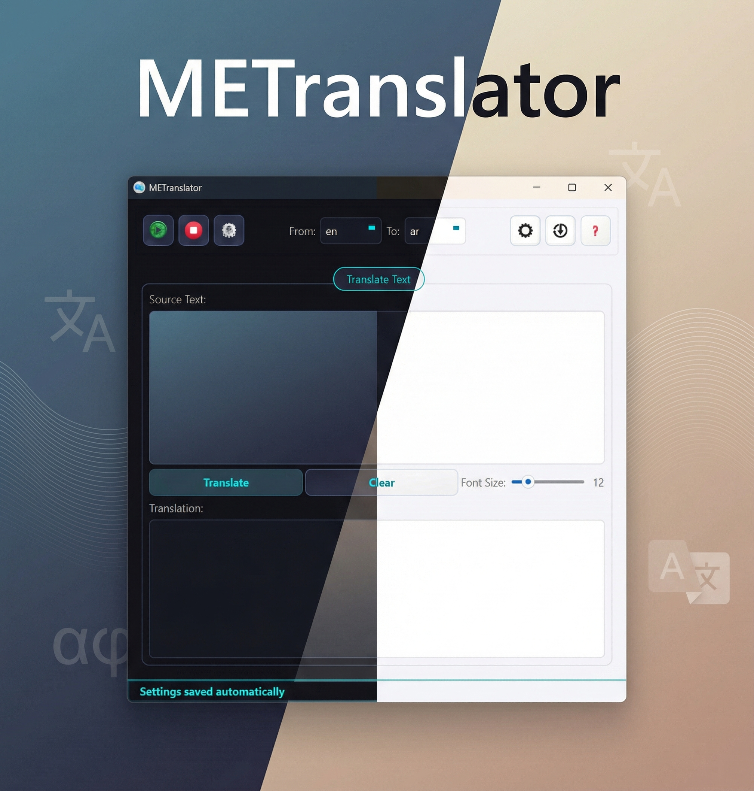
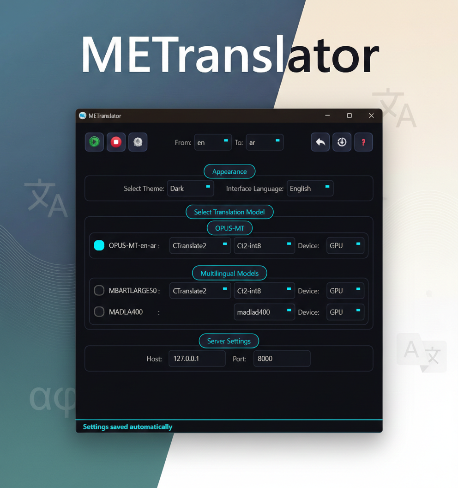
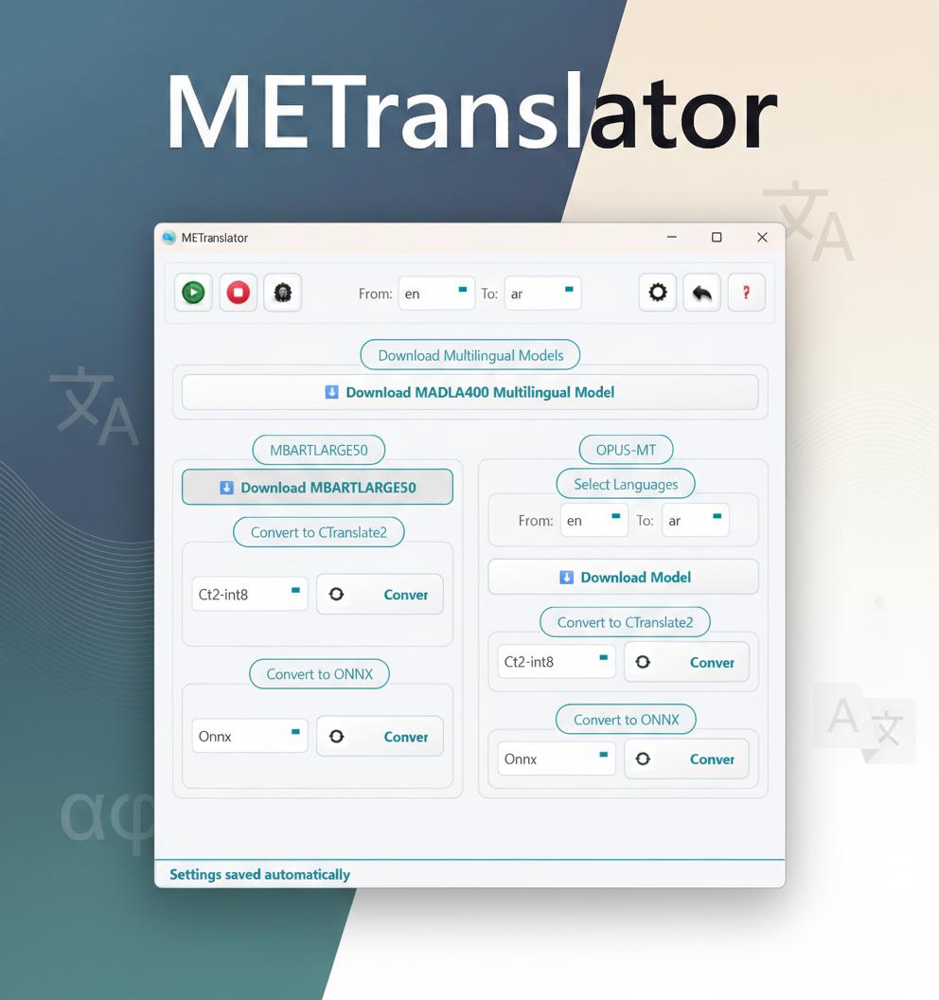
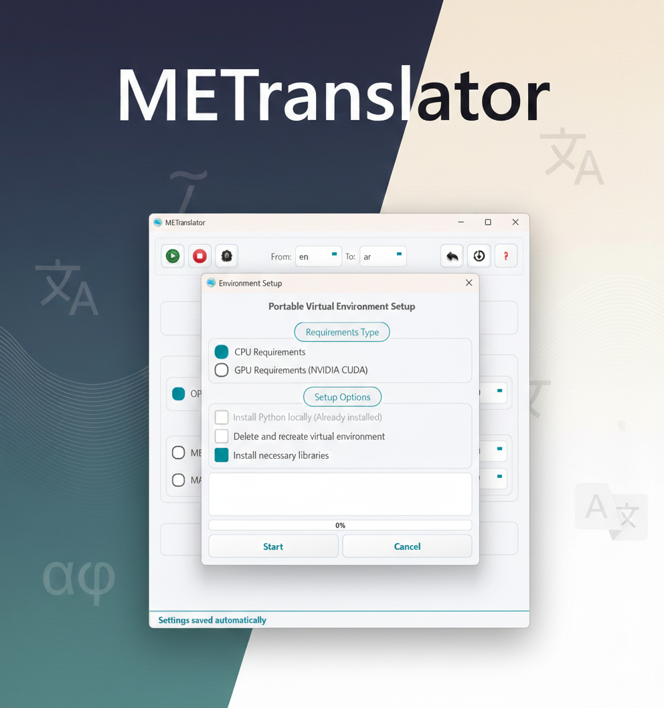
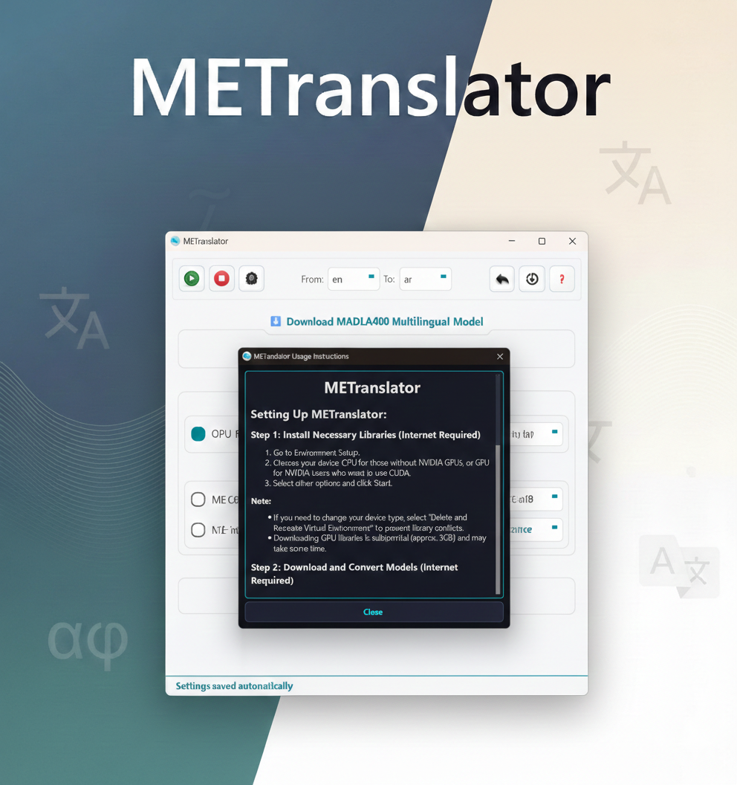

# 🎮 METranslator
[English](README.md)


**METranslator** هي أداة ترجمة قوية تركز على الخصوصية وتعمل محليًا أولاً، مصممة خصيصًا للألعاب والنصوص العامة. تستفيد من أحدث نماذج الترجمة الآلية العصبية لتوفير ترجمات عالية الجودة مباشرة على جهازك.

---

## ✨ الميزات الرئيسية

- **🏠 معالجة محلية 100%:** بياناتك لا تغادر جهاز الكمبيوتر الخاص بك أبدًا. يتم إجراء جميع الترجمات محليًا باستخدام نماذج الذكاء الاصطناعي القوية.
- **🚀 تسريع الأجهزة:** يدعم كلاً من **CPU** و **NVIDIA GPU (CUDA)** لسرعات ترجمة فائقة السرعة.
- **🧠 واجهات خلفية متعددة للذكاء الاصطناعي:**
  - **OPUS-MT:** نماذج عالية الأداء لأزواج لغوية محددة.
  - **MADLAD-400:** نموذج ضخم متعدد اللغات لتنوع عالي الجودة.
  - **mBART-50:** ترجمة متعددة الاستخدامات من العديد إلى العديد.
- **🛠️ محول نماذج مدمج:** قم بتحويل النماذج بسهولة إلى تنسيقات **CTranslate2** أو **ONNX** لتحسين الأداء لأجهزتك المحددة.
- **📦 بيئة محمولة:** إعداد تلقائي ينشئ بيئة Python قائمة بذاتها دون العبث بإعدادات النظام الخاصة بك.
- **🌍 واجهة مستخدم متعددة اللغات:** دعم أصلي للغات **العربية**، **النجيليزية**، **الفرنسية**، **الألمانية**، **الإسبانية**، **الإيطالية**، **البرتغالية**، **الروسية**، **الصينية**، **اليابانية**، **الكورية**.
  *(ملاحظة: تم إنشاء ترجمات الواجهة بواسطة الذكاء الاصطناعي. إذا وجدت أي أخطاء، يرجى إبلاغي بها).*

## 🔌 التكامل مع LunaTranslator

برنامج METranslator متوافق كلياً مع [LunaTranslator](https://github.com/HIllya51/LunaTranslator)، وهو مترجم مشهور للروايات المرئية (Visual Novels).

لاستخدام METranslator كمصدر للترجمة في LunaTranslator:
1. قم بتحميل ملف الإعداد المعدل: [**LunaTranslator Selfbuild Script**](https://github.com/Marwan087/LunaTranslator-METranslator-Config)
2. ضع هذا الملف داخل مجلد `userconfig` في مسار تثبيت LunaTranslator.
3. اختر Custom Translation في إعدادات LunaTranslator.

*(هذا التكامل يعتمد على ملف `selfbuild.py` معدل، وهو في الأصل من مشروع LunaTranslator).*

---

## 📸 لقطات الشاشة

<p align="center">
  <b>الواجهة الرئيسية</b><br>
  
</p>

<p align="center">
  <b>تكوين الإعدادات</b><br>
  
</p>

<p align="center">
  <b>إدارة التنزيل والتحويل</b><br>
  
</p>

<p align="center">
  <b>إعداد البيئة الافتراضية</b><br>
  
</p>

<p align="center">
  <b>تعليمات الاستخدام</b><br>
  
</p>

---

## 🛠️ المتطلبات الأساسية

- **نظام التشغيل:** Windows 10/11 (يوصى بـ 64 بت).
- **وحدة معالجة الرسوميات (اختياري):** NVIDIA GPU مع دعم CUDA لترجمة أسرع بشكل ملحوظ.
- **ذاكرة الوصول العشوائي (RAM):** 8 جيجابايت كحد أدنى (يوصى بـ 16 جيجابايت فأكثر). **ملاحظة: يتطلب تحويل ONNX ما لا يقل عن 16 جيجابايت من ذاكرة الوصول العشوائي.**
- **مساحة القرص:** حوالي 500 ميجابايت للتطبيق الأساسي، بالإضافة إلى 1 جيجابايت - 4 جيجابايت حسب نماذج الذكاء الاصطناعي التي تختار تنزيلها.

---

## 🚀 البدء السريع

1. **تنزيل:**
   - قم بتنزيل أحدث إصدار من [Releases](https://github.com/Marwan087/METranslator/releases).
   - استخرج الأرشيف إلى الموقع الذي تريده.

   *أو*

2. **استنسخ المستودع (Clone the Repository):**
   ```bash
   git clone https://github.com/Marwan087/METranslator.git
   cd METranslator
   ```

3. **شغل المثبت (Run the Installer/App):**
   قم بتشغيل `gui_installer.py` (أو `METranslator.exe` المترجم). سيقوم المثبت بما يلي:
   - إعداد بيئة تشغيل Python محلية.
   - تثبيت جميع التبعيات الضرورية (`PySide6`, `requests`, وما إلى ذلك).

4. **ابدأ التطبيق:**
   بمجرد التثبيت، قم تشغيل `METranslator.exe`.

5. **الإعداد في التطبيق:**
   - **الخطوة 1: إعداد البيئة:** اختر نوع جهازك (**CPU** أو **GPU**). انقر فوق **بدء** لتثبيت مكتبات الذكاء الاصطناعي المحددة (ملاحظة: قد يقوم إعداد GPU بتنزيل حوالي 3 جيجابايت من مكتبات CUDA).
   - **الخطوة 2: الحصول على النموذج:** في **التنزيل والتحويل**، اختر زوج اللغة الخاص بك أو نموذج متعدد اللغات (MADLAD/mBART).
   - **الخطوة 3: التحسين (اختياري):** قم بتحويل النماذج إلى **CTranslate2** أو **ONNX** للحصول على أقصى أداء على أجهزتك.
   - **الخطوة 4: التشغيل:** انتقل إلى **الإعدادات** لتحديد النموذج والجهاز الخاص بك، ثم انقر فوق **تشغيل الخادم** ▶ لبدء الترجمة!
---

## 🛠️ كيفية البناء

إذا كنت ترغب في بناء ملفات التنفيذ (`.exe`) بنفسك، فاتبع الخطوات التالية:

### 1. المتطلبات
- **إصدار Python:** [Python 3.13.5](https://www.python.org/downloads/release/python-3135/) (تأكد من إضافته إلى PATH الخاص بك).
- **أداة الضغط:** يجب تثبيت [7-Zip](https://www.7-zip.org/) (لإنشاء الأرشيف النهائي).
- **تبعية البناء:** قم بتثبيت المكتبات المطلوبة باستخدام:
  ```bash
  pip install -r requirementsbuild.txt
  ```
  *(تشمل المكتبات: `pyinstaller`, `cx_freeze`, `certifi`, and `requests`)*.

### 2. عملية البناء
قم تشغيل البرنامج النصي المجمع المقدم لأتمتة عملية البناء:
```bash
build_release.bat
```
سيقوم هذا البرنامج النصي بما يلي:
1. تجميع التطبيق الرئيسي باستخدام `cx_Freeze`.
2. حزم برنامج إلغاء التثبيت باستخدام `PyInstaller`.
3. تنظيم جميع الملفات الضرورية في مجلد مؤقت.
4. **إنشاء أرشيف مضغوط `METranslator.7z`** (الحزمة النهائية الجاهزة للاستخدام).
5. تنظيف أدلة البناء المؤقتة.

---

## 🏗️ التقنيات المستخدمة

- **إطار عمل واجهة المستخدم:** [PySide6 (Qt for Python)](https://www.qt.io/qt-for-python)
- **واجهة برمجة التطبيقات (API) الخلفية:** [FastAPI](https://fastapi.tiangolo.com/) & [Uvicorn](https://www.uvicorn.org/)
- **محرك الذكاء الاصطناعي:** [Hugging Face Transformers](https://huggingface.co/docs/transformers/index), [CTranslate2](https://opennmt.net/CTranslate2/), and [ONNX Runtime](https://onnxruntime.ai/)
- **النماذج:** شكرًا لـ [Helsinki-NLP](https://huggingface.co/Helsinki-NLP), [Google (MADLAD)](https://huggingface.co/google/madlad400-3b-mt), and [Facebook (mBART)](https://huggingface.co/facebook/mbart-large-50-many-to-many-mmt).

---


## 📜 الترخيص

هذا المشروع مرخص بموجب **GNU General Public License v3.0**. راجع ملف [LICENSE](LICENSE) لمزيد من التفاصيل.

---

## 🤝 المساهمة

المساهمات مرحب بها! إذا كان لديك اقتراحات للتحسين أو واجهت أخطاء، يرجى فتح مشكلة (Issue) أو إرسال طلب سحب (Pull Request).

---

## ✉️ التواصل

**المؤلف:** Marwan Alhamaty
**البريد الإلكتروني:** marwanalhamaty87@gmail.com
**رابط المشروع:** [https://github.com/Marwan087/METranslator](https://github.com/Marwan087/METranslator)

---
*تم التطوير بـ ❤️ لمجتمع الألعاب والترجمة.*


